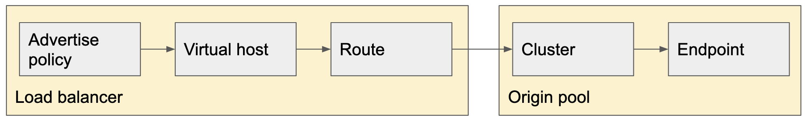

# Load balancer and Origin pool

Load balancer consists of multiple components below,

1. Endpoint
2. Cluster
3. Route
4. Virtual host
5. Advertise policy

In Configuration, Origin pool configures Endpoint and Cluster. Load balancer configures Route, Virtual host and Advertise policy.

## Role of items

### Endpoint

Endpoint is the actual service or application. It can be defined by IP address, FQDN, Kubernetes services. It is associated with Cluster.

### Cluster

Cluster sets one or more endpoints and is associated with Route. Cluster defines Health check of endpoint, algorithms of Endpoint selection, Circuit Breaker and so on.

### Route

Route configures L7 routing decision. When the HTTP traffic comes in, route steer the traffic to a certain cluster by HTTP method, HTTP path or any.
Virtual Host
Virtual Host connects Advertise policy and Route object by a specified proxy type. Virtual Host can add security parameters such as WAF, CORS policy, Rate limiting and so on.

### Advertise Policy

Advertise Policy controls where the service listens. It can be configured to both the same site of Endpoint and a different site from Endpoint.
