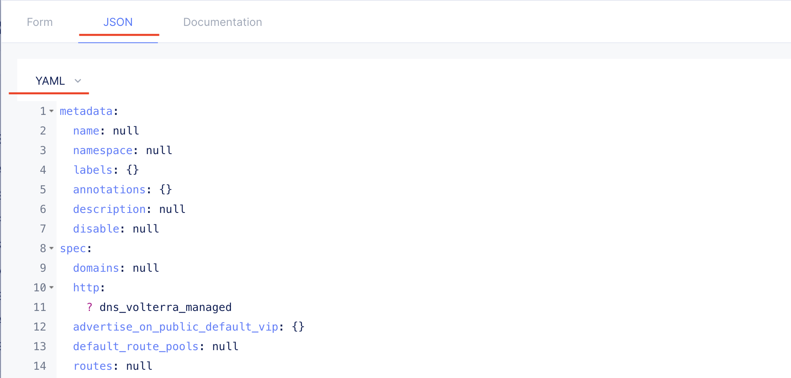
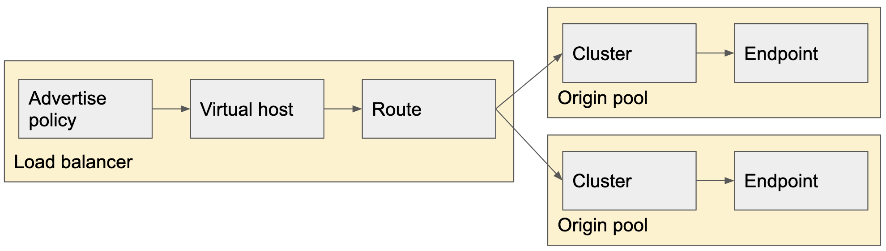
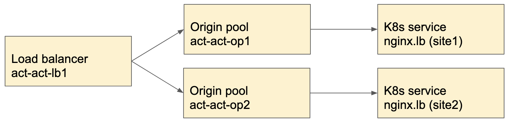

# Active Active load balancing

There are two configuration designs about Active Active load balancing.

1. One origin pool having multiple endpoints
2. Multiple origin pools having one or more endpoints respectively

## One origin pool having multiple endpoints

This model steers the traffic where the endpoints are located. When the traffic reaches Cluster, Cluster selects a certain Endpoint based on “Endpoint Selection”. The typical use case of this model is that a user wants to steer the traffic to the same site as the Load balancer.

When the user wants to use `Cookie Based stickiness` and `Source IP stickiness`, the user must use this model. The algorithm doesn’t work when the multiple Origin pools are configured in the Load balancer.
The algorithm is defined by user configuration such as Roudrobin, Least connection an so on.

### Sample configuration

There are two kubernetes service associating with a single Origin pool.
The Origin pool strees the traffic where it reaches to pods.

### Create Origin pool and Load balancer

Precondition:

1. There are two sites `site1` and `site2`
2. Apply [act_act_nginx1.yaml](./yaml/act_act_lb/act_act_nginx1.yaml) by kubectl apply -f

<b>VoltMesh Configuration</b>

#### 1. Create Origin pool

Configure two k8s service into one origin pool.
Sample config: [act_act_op1.yaml](./yaml/act_act_lb/act_act_op1.yaml)

##### How to apply to yaml file

There are two ways to apply yaml file. All Volterra object has UI From or Volterra app (vesctl).

1. Copy and paste the yaml by UI.

Open the any configuration object and Click `JSON` tab in the window. The JSON window can be selected JSON or YAML (Default is JSON). Copy and paste the sample configuration then Save and Exit.

#### 2. Create Load balancer

Configure Load balanacer associating with the Origin pool above.
Sample config: [act_act_lb1.yaml](./yaml/act_act_lb/act_act_lb1.yaml)

#### 3. Confirm traffic steering

Open the FQDN configured by #2 by your browser or `curl`, you can see the traffic steers by round robbin fashion.

## Multiple origin pools having one or more endpoints respectively

This model steers the traffic across multiple Origin pool based on Weight. When the traffic reaches Route, the Route selects a certain Cluster based on Routes configuration and Weight. 
When the user wants to steer the traffic based on HTTP parameters, this model is useful.
The typical use case of this model is that a user wants to steer the traffic to the certain Clusters like canaly upgrade. When there are two clusters running the same application. When the one application upgrades, the ratio of weight is set as 1:9. The traffic going to the new version is 10% of total traffic.

The Load balance algorithm of Origin pool selection is defined by Weight instead of Load balancer algorithm. When the traffic is selected the Origin pool, it steers the traffic based on Load balancer Algorithm.

### Sample configuration

There are two kubernetes service associating with a Origin pool respectively.
The Load balancer (Route) strees the traffic where it reaches to Origin pools. 

### Create Origin pool and Load balancer

Precondition:

1. There are two sites `site1` and `site2`
2. Apply [nginx1.yaml](./yaml/nginx1.yaml) by kubectl apply -f

<b>VoltMesh Configuration</b>

#### 1. Create Origin pool

Configure two k8s service into one origin pool.
Sample config: [act_act_op2-1.yaml](./yaml/act_act_lb/act_act_op2-1.yaml), [act_act_op2-2.yaml](./yaml/act_act_lb/act_act_op2-2.yaml)

#### 2. Create Load balancer

Configure Load balanacer associating with the two Origin pool above.
Sample config: [act_act_lb2.yaml](./yaml/act_act_lb/act_act_lb2.yaml)

#### 3. Confirm traffic steering

Open the FQDN configured by #2 by your browser or `curl`, you can see the traffic steers by round robbin fashion.

## Mix above two models into one

It can use both above two models into one service. This is a little bit complicated but Route based Load balancing and Cluster based Load balancing work at the same time. 

This is a little bit complex how to load balancing the traffic.
When the traffic comes into Load balancer, the traffic steers based on the Weight congiguration. Route comportnent decide where the traffic goes.

The traffic reaches Origin pool, cluster steers traffic based on the Load balance algorithm.

For instance, when there are two Origin pool having weight is `100` and the algorithm is `Cookie Based Stickiness`, the traffic steers to the two Origin pool equally. Stickiness only works on Endpoint selection.

If you want to adopt the Stickiness, you should use `One origin pool having multiple endpoints`.