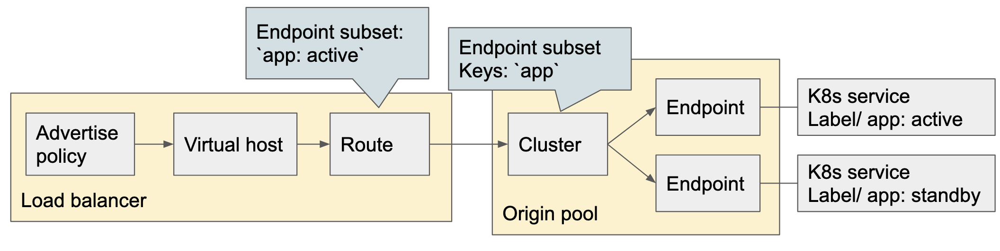
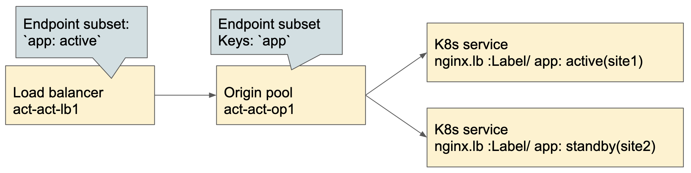

# Active Standby load balancing

There are two configuration designs about Active Standby load balancing.

1. One origin pool having Active/Standby endpoints
2. Load balancer having Active/Standby Origin pool (In design)

## One origin pool having multiple endpoints



This model is so called Active/Standby. Traffic always steers to the Active endpoint only. When the Active endpoint is down, the traffic steers to the Standby endpoint.

The Active/Standby endpoint is defined by `Subset keys` and its value. The subset in Load balancer object configures the Subsets Lables (Key and value) and Origin pool configures Endpoint subset assosiating with Load balancer.

### Sample configuration

There are two kubernetes service associating with a single Origin pool.
The Origin pool strees the traffic where it reaches to pods.



### Create Origin pool and Load balancer

Precondition:

1. There are two sites `site1` and `site2`
2. Apply [act_stb_nginx1.yaml](./yaml/act_stb_lb/act_stb_nginx1.yaml) by kubectl apply -f

<b>VoltMesh Configuration</b>

#### 1. Create Health Check

Health check configuration is required to detect either the endpoint is working or not.
This object assositates with Origin pool object.
Sample config: [act_stb_hc1.yaml](./yaml/act_stb_lb/act_stb_hc1.yaml)

#### 2. Create Origin pool

Configure two k8s service into one origin pool.
Sample config: [act_stb_op1.yaml](./yaml/act_stb_lb/act_stb_op1.yaml)

The point in this configuration is the `endpoint-subsets`. This field defines which label key is used for the endpoint selection.

```
    enable_subsets:
      endpoint_subsets:
        - keys:
            - app
```

Note: The defined Lable in Subset must be configured in Share namespace.

#### 3. Create Load balancer

Configure Load balanacer associating with the Origin pool above.
Sample config: [act_stb_lb1.yaml](./yaml/act_stb_lb/act_stb_lb1.yaml)

The point in this configuration is the `endpoint-subsets as well. This field defines which label is used for the endpoint selection.

```
        advanced_options:
          endpoint_subsets:
            app: active
```

#### 4. Confirm traffic steering

Open the FQDN configured by #2 by your browser or `curl`, you can see the traffic steers only to Active pod.
When you suspend the active k8s service, Load balancer steers the traffit to standby pod.